## Parte 1
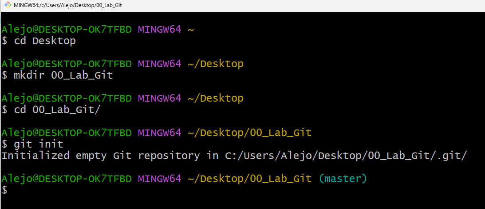
Aquí podemos ver cómo me muevo al Escritorio, creo la carpeta 00_Lab_Git, entro en ella, e inicializo un repositorio local.
---
## Parte 2
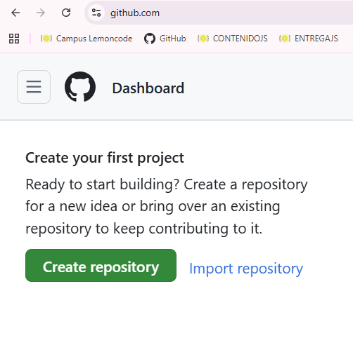
---
Vamos a GitHub, entramos en nuestra cuenta y le damos al botón "Create repository".
---
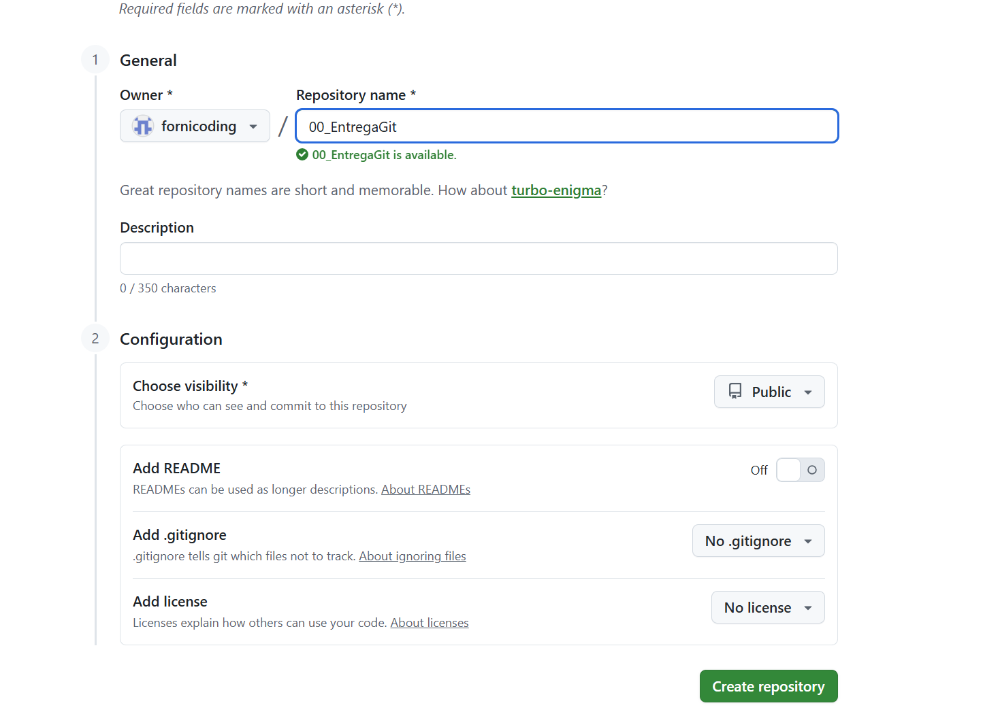
---
Nombramos nuestro repositorio, importante que venga sin readme.md creado.
---
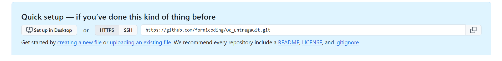
---
Copiamos el enlace proporcionado después de crearlo.
---
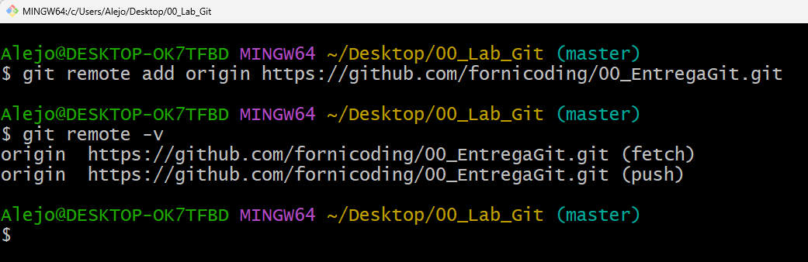
---
Volvemos a la terminal y escribimos ``` git remote add origin ``` seguido por el enlace.
Y para confirmar que funciona, usamos ``` git remote -v ``` y si vemos "origin" seguido por el enlace del repositorio GitHub, lo hemos conectado correctamente.
---
## Parte 3
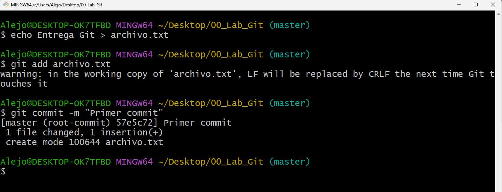
---
Podemos ver cómo creo un "archivo.txt" con ``` echo ```, lo muevo a staging, y hago un commit.
---
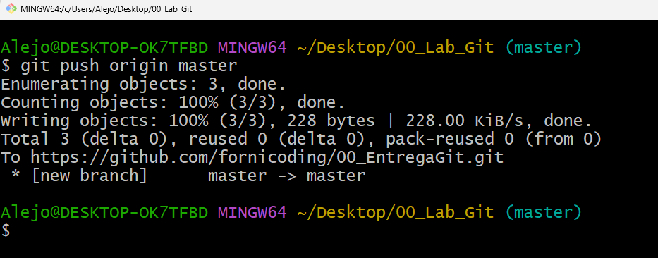
---
Por último, lo subo al repositorio en GitHub.
---
## Parte 4

---
Creamos la rama "development", nos movemos a ella, y editamos con el bloc de notas el "archivo.txt".
---
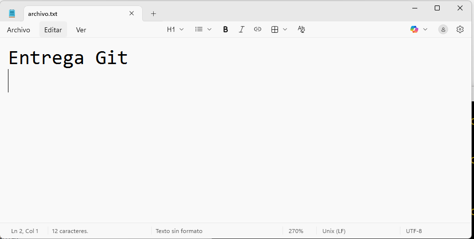
---
Podemos ver que lo he creado con el texto "Entrega Git".
---
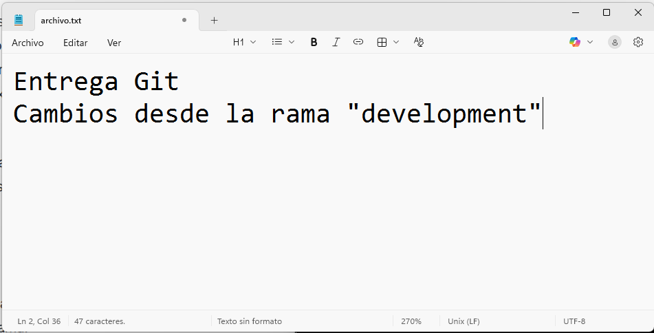
---
Escribimos una frase debajo.
---
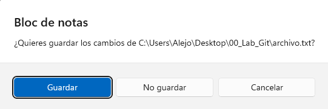
---
Le damos a cerrar el bloc de notas, y guardamos el "archivo.txt" con sus cambios.
---
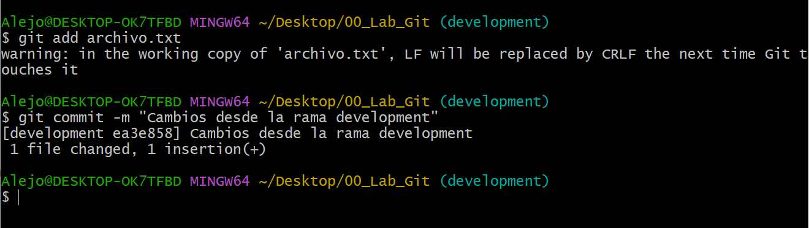
---
Lo pasamos a staging, y hacemos un commit.
---
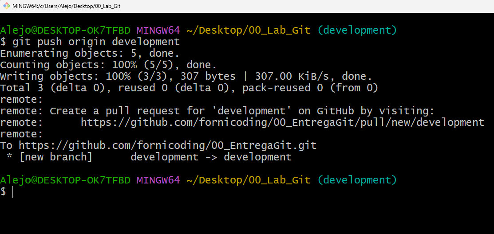
---
Igual que antes, hacemos un push para subirlo al repositorio en GitHub.
---
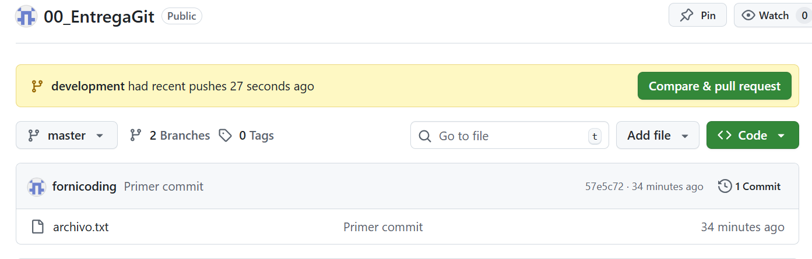
---
Podemos ver que GitHub nos avisa que hemos hecho un push desde la rama "development" y nos pide que comparemos y pulleemos este push. No tocamos nada ya que si lo hacemos nos mezcla ambas ramas automáticamente y buscamos mezclarlas luego.
---
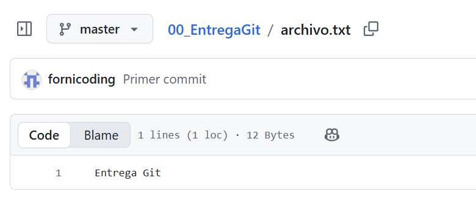
---
Podemos ver que el "archivo.txt" sigue exactamente igual de como lo creamos en la rama "master".
---
## Parte 5
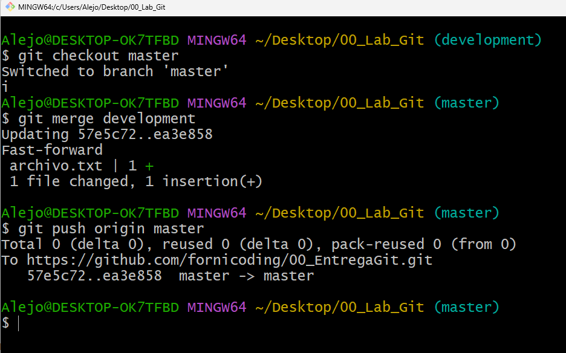
---
Nos movemos de vuelta a la rama "master" y mezclamos la rama "development" con la rama en la que estamos, que es "master", si fuesen a haber conflictos, los arreglamos, pero en este caso no ocurre. Por último, hacemos un push desde la rama "master" para subir todo ya mezclado.
---
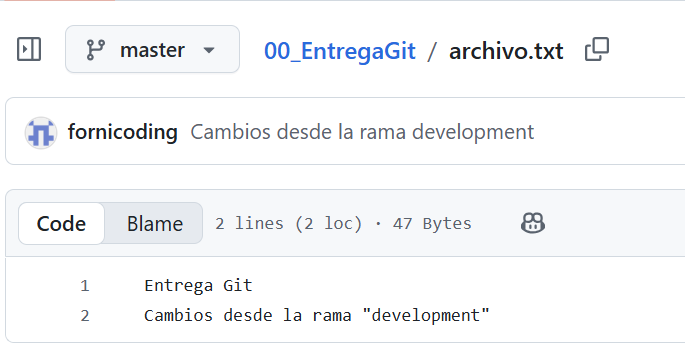
---
Ahora, cuando miramos el "archivo.txt" en nuestro repositorio de GitHub, se vé como hemos mezclado las ramas y por ende el contenido del archivo.
